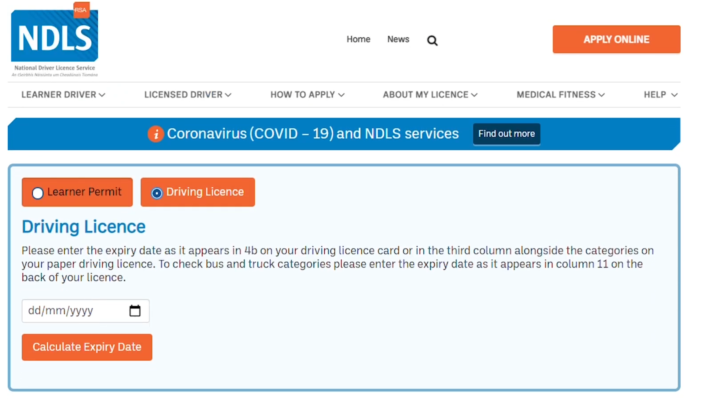
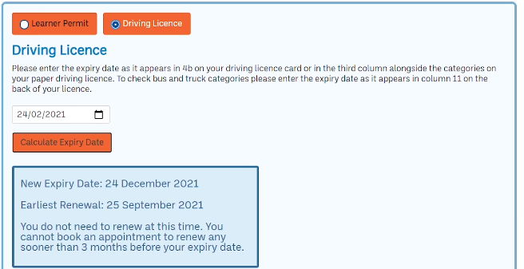

# NDLS Expiry Date Calculator 🗓️

This calculator was created for NDLS to help with calculating the expiry and renewal dates for learner permits and driving licences in Ireland. Although it's no longer in active use.



## About The Project

The NDLS Expiry Date Calculator was developed to reduce the amount of calls that the NDLS were receiving in relation to the then-recent changes in learner and driving license renewal dates. Given the original expiry date, it calculates:

- **New Expiry Date:** Based on the NDLS's extension policies during specific periods.
- **Earliest Renewal Date:** So you know the best time to apply for a renewal without any hassle.

This project was a great opportunity to dive deep into JavaScript, especially focusing on DOM manipulation and date calculations. It was also an exercise in making something genuinely useful for a real-world scenario, albeit for a brief period.

## Technical Challenges

One of the main technical challenges was ensuring the calculator worked seamlessly across all browsers, including older versions like Internet Explorer 10. To achieve this, we used Babel to transpile the code, ensuring compatibility without compromising on the modern JavaScript features we wanted to use.

### Babel Configuration

This setup allowed us to write our JavaScript in ES6+ syntax while still supporting browsers that only understand older versions of JavaScript.

### Custom Date Functions

Rather than relying on heavy external libraries like Moment.js for date calculations, we opted to create our own lightweight date functions. This decision was made to keep the project as lean as possible, ensuring fast load times and a smooth user experience across all devices and connection speeds.

## Features

- Calculate new expiry dates and earliest renewal dates for learner permits and driving licences.
- Clear, user-friendly interface for easy operation.
- Error handling for invalid inputs.
- Results include direct links for renewal booking, guiding users on the next steps.



## How It Works

The magic happens through a series of JavaScript functions tied together by event listeners waiting for the user's input. Here's a breakdown of the process:

1. **User Input:** Selects the type of document (learner permit or driving licence) and enters the current expiry date.
2. **Calculation:** Based on the selected document type and input date, the calculator applies specific extension rules to compute the new expiry and earliest renewal dates.
3. **Display Results:** Shows the calculated dates along with a custom message guiding the user on whether they need to renew now or later.

## Technologies Used

- **HTML & CSS:** For the skeleton and skin of our calculator.
- **JavaScript:** The brains behind the operation, handling all calculations and user interactions, with Babel for browser compatibility.

## Setup & Usage

Feel free to clone this repo and explore the calculator on your local machine. Here's how to get it up and running:

```bash
git clone https://github.com/yourusername/ndls-expiry-calculator.git
cd ndls-expiry-calculator
# Open index.html in your favorite browser
